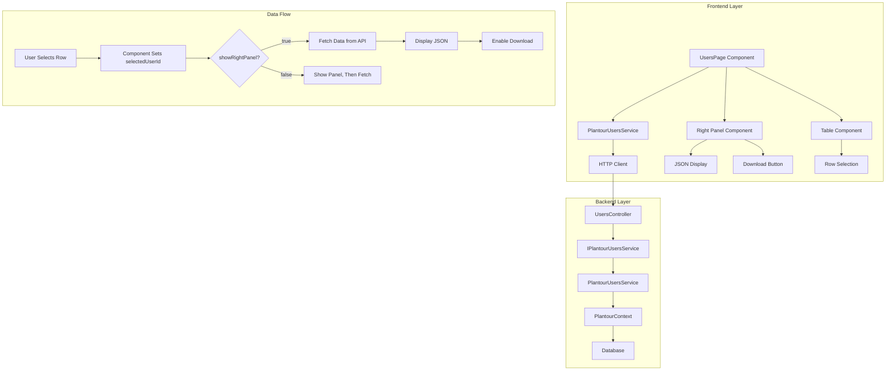

# User Data Explorer - Workflow Diagram

```mermaid
flowchart TD
    A[Users Page Loads] --> B[User Clicks Row]
    B --> C{Right Panel Visible?}
    C -->|No| D[Show Right Panel]
    C -->|Yes| E[Fetch Comprehensive Data]
    D --> E
    
    E --> F[API Call: GET /users/{id}/comprehensive]
    F --> G[Service Loads All Related Data]
    G --> H[Return JSON Response]
    H --> I[Display Formatted JSON]
    
    I --> J{User Clicks Download}
    J --> K[Create JSON Blob]
    K --> L[Trigger File Download]
    
    B --> M{Same User Selected?}
    M -->|Yes| N[No Action - Data Already Displayed]
    M -->|No| O[Clear Current Data, Fetch New]
    
    style A fill:#e1f5fe
    style F fill:#f3e5f5
    style L fill:#e8f5e8
```

## Component Architecture



## UI Layout Mockup

```
+---------------------------------------------------------------+
|  Plantour Operations Console                                  |
|  [Visitors] [Users] [Logs] [Plantour Settings]               |
+---------------------------------------------------------------+
|  Filter: [_______________]  Group: [Select]  Period: [All]   |
|                                                               |
|  +---------------------------------------------------------+  |
|  | ID        | Email           | Full Name | Role | ...    |  |
|  |-----------|-----------------|-----------|------|--------|  |
|  | abc123    | user1@email.com | John Doe  | Admin| ...    |  | <-- Selected
|  | def456    | user2@email.com | Jane Smith| User | ...    |  |
|  | ...       | ...             | ...       | ...  | ...    |  |
|  +---------------------------------------------------------+  |
|                                                               |
|  Page 1 of 5 | Rows per page: [20] | First Prev Next Last    |
|                                                               |
|  +---------------------------------------------------------+  |
|  |                    RIGHT PANEL                          |  |
|  |  User Data Explorer                      [X] [Download] |  |
|  |  ------------------------------------------------------ |  |
|  |  {                                                      |  |
|  |    "id": "abc123",                                      |  |
|  |    "email": "user1@email.com",                          |  |
|  |    "firstName": "John",                                 |  |
|  |    "lastName": "Doe",                                   |  |
|  |    "userSettings": [ ... ],                             |  |
|  |    "trips": [ ... ],                                    |  |
|  |    ...                                                  |  |
|  |  }                                                      |  |
|  +---------------------------------------------------------+  |
+---------------------------------------------------------------+
```

## Key Interactions

1. **Row Selection**: Click any row in the table to select a user
2. **Panel Toggle**: 
   - First click on selected row shows panel and loads data
   - Click "X" button hides panel
   - Panel retains data when hidden, clears when new user selected
3. **Data Loading**: Shows loading indicator while fetching
4. **Error Handling**: Displays error message if API call fails
5. **Download**: Creates JSON file with timestamp in filename

## Responsive Behavior
- On smaller screens, right panel becomes overlay/modal
- JSON display has horizontal scroll for long lines
- Panel width adjustable (optional enhancement)